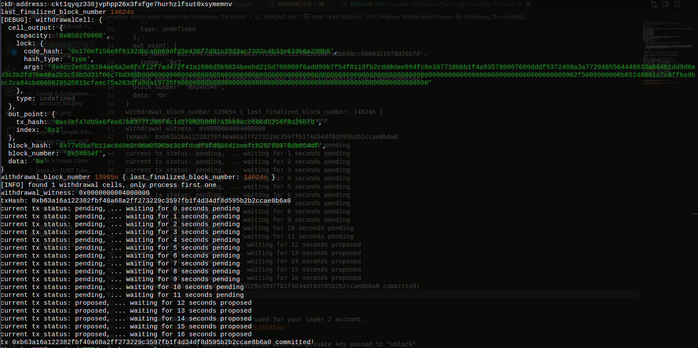

* ### [Gitcoin: 10) Complete Withdrawal Process By Unlocking The Funds]()

* A screenshot of the console output immediately after running the "unlock" command:


Text version of output:
```
LUMOS_CONFIG_NAME: AGGRON4
current indexer data path: ./indexer-data-path/0x10639e0895502b5688a6be8cf69460d76541bfa4821629d86d62ba0aae3f9606
Indexer is syncing. Please wait.
Syncing 99.94% completed.
Syncing 99.95% completed.
Syncing 99.96% completed.
Syncing 99.97% completed.
Syncing 99.98% completed.
Syncing 99.99% completed.
Indexer synchronized.
rollup_type_hash: 0x4cc2e6526204ae6a2e8fcf12f7ad472f41a1606d5b9624beebd215d780809f6a
ckb address: ckt1qyqz338jvphpp26x3fxfge7hurhzlfsut0xsymemnv
last_finalized_block_number 14624n
[DEBUG]: withdrawalCell: {
  cell_output: {
    capacity: '0x9502f9000',
    lock: {
      code_hash: '0x170ef156e9f6132dbca6069dfd3e436f7d91c29d3ac7332c4b33e633b6a299b5',
      hash_type: 'type',
      args: '0x4cc2e6526204ae6a2e8fcf12f7ad472f41a1606d5b9624beebd215d780809f6add99b7f54f0119fb2cdd8dee094fc6e397718bbb1f4a935780007609dddf5372469a3a7729485564446633a604b1dd9d6ed3c2b2fd7be48a2b3c53b3d31f00c78d3600000000000000000000000000000000000000000000000000000000000000000000000000000000000000000000000000000000000000902f5009000000b65248061c7c0ffba9bec2ca84cbd609070525915cfaec75a263dfa9da19735f0000000000000000000000000000000000000000000000000000000000000000'
    },
    type: undefined
  },
  out_point: {
    tx_hash: '0xc7ef47db9e6fee87b8377f286f4c1d27082b8887a3bb90cc6b603216f8d26b7d',
    index: '0x3'
  },
  block_hash: '0x77ebbafb11ac8d0e2c06a0596bc3c8fdcdf9fd586d1becfcb25766978db854df',
  block_number: '0x24654f',
  data: '0x'
}
withdrawal_block_number 13965n { last_finalized_block_number: 14624n }
[INFO] found 1 withdrawal cells, only process first one
withdrawal_witness: 0x0000000004000000
txHash: 0xb63a16a122382fbf40a68a2ff273229c3597fb1f4d34df8d595b2b2ccae8b6a0
current tx status: pending, ... waiting for 0 seconds pending
current tx status: pending, ... waiting for 1 seconds pending
current tx status: pending, ... waiting for 2 seconds pending
current tx status: pending, ... waiting for 3 seconds pending
current tx status: pending, ... waiting for 4 seconds pending
current tx status: pending, ... waiting for 5 seconds pending
current tx status: pending, ... waiting for 6 seconds pending
current tx status: pending, ... waiting for 7 seconds pending
current tx status: pending, ... waiting for 8 seconds pending
current tx status: pending, ... waiting for 9 seconds pending
current tx status: pending, ... waiting for 10 seconds pending
current tx status: pending, ... waiting for 11 seconds pending
current tx status: proposed, ... waiting for 12 seconds proposed
current tx status: proposed, ... waiting for 13 seconds proposed
current tx status: proposed, ... waiting for 14 seconds proposed
current tx status: proposed, ... waiting for 15 seconds proposed
current tx status: proposed, ... waiting for 16 seconds proposed
tx 0xb63a16a122382fbf40a68a2ff273229c3597fb1f4d34df8d595b2b2ccae8b6a0 committed!
```


* The Ethereum address that you've used for your Layer 2 account:
`0x37C2b41ea4a10308d043F790493A3CdEc28585ae`

* The Nervos Layer 1 address associated with the private key passed to "unlock":
`ckt1qyqz338jvphpp26x3fxfge7hurhzlfsut0xsymemnv`