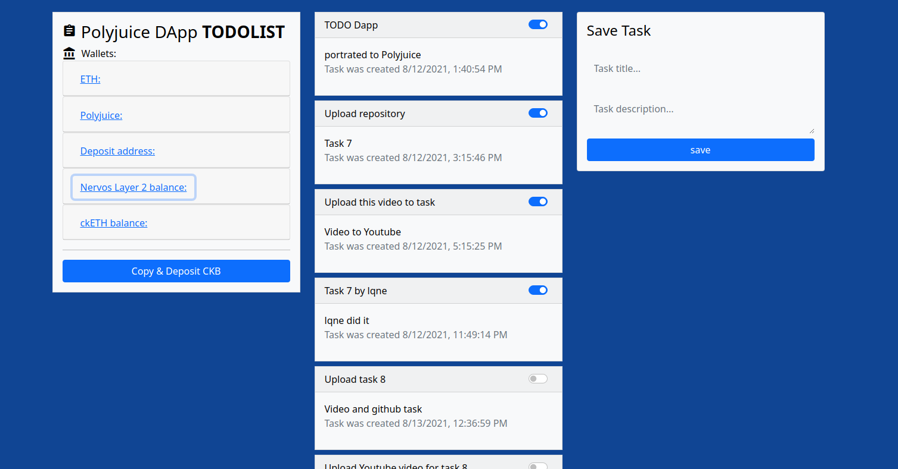
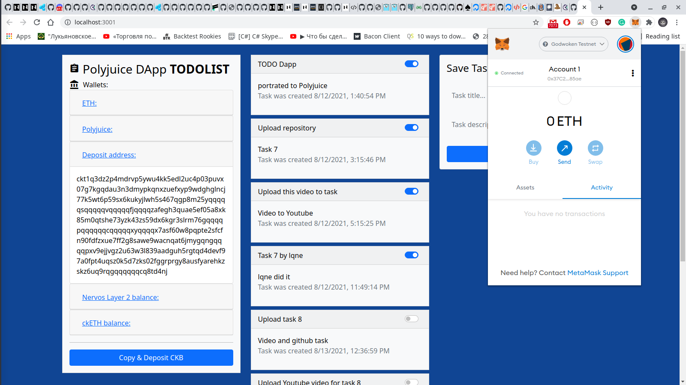

* ### Gitcoin: 8) Modify The Ported DApp So It Supports Ethereum Assets Via Force Bridge

* A screenshot or video of your EVM application on Layer 2 with Force Bridge support:

* The address of the SUDT-ERC20 Proxy Contract that you deployed:
`0xD5A6a78E967cd70C6791d5289B3E4b1D5D55eC27`

* A link to the GitHub repository with your EVM application that integrates Force Bridge support

[TODO LIST DAPP](https://github.com/x777/todo-dapp-polyjuice)