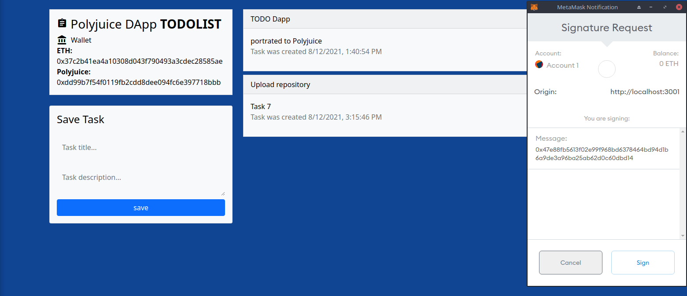
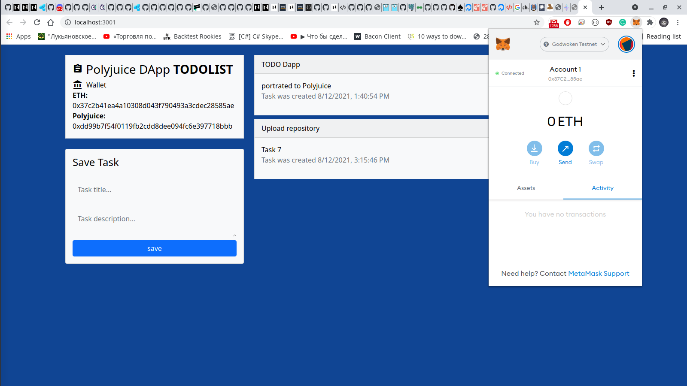

* ### Gitcoin: 7) Port An Existing Ethereum DApp To Polyjuice

* Screenshots or video of your application running on Godwoken

* Link to the GitHub repository with your application which has been ported to Godwoken:

[TODO LIST DAPP](https://github.com/x777/todo-dapp-polyjuice)

* If you deployed any smart contracts as part of this tutorial, please provide the transaction hash of the deployment transaction, the deployed contract address, and the ABI of the deployed smart contract:

* transaction hash: `0x1d87cd180ee4ad7f5f2e3e9554a60639c53a6fff546392d40eff059a8a5525cb`

* contract address: `0x57a4d44de477A569766Ab934Fff38281d034f3EF`

* ABI: 
`"abi": [
    {
      "inputs": [],
      "payable": false,
      "stateMutability": "nonpayable",
      "type": "constructor"
    },
    {
      "anonymous": false,
      "inputs": [
        {
          "indexed": false,
          "internalType": "uint256",
          "name": "id",
          "type": "uint256"
        },
        {
          "indexed": false,
          "internalType": "string",
          "name": "title",
          "type": "string"
        },
        {
          "indexed": false,
          "internalType": "string",
          "name": "description",
          "type": "string"
        },
        {
          "indexed": false,
          "internalType": "bool",
          "name": "done",
          "type": "bool"
        },
        {
          "indexed": false,
          "internalType": "uint256",
          "name": "createdAt",
          "type": "uint256"
        }
      ],
      "name": "TaskCreated",
      "type": "event"
    },
    {
      "anonymous": false,
      "inputs": [
        {
          "indexed": false,
          "internalType": "uint256",
          "name": "id",
          "type": "uint256"
        },
        {
          "indexed": false,
          "internalType": "bool",
          "name": "done",
          "type": "bool"
        }
      ],
      "name": "TaskToggledDone",
      "type": "event"
    },
    {
      "constant": true,
      "inputs": [],
      "name": "taskCounter",
      "outputs": [
        {
          "internalType": "uint256",
          "name": "",
          "type": "uint256"
        }
      ],
      "payable": false,
      "stateMutability": "view",
      "type": "function"
    },
    {
      "constant": true,
      "inputs": [
        {
          "internalType": "uint256",
          "name": "",
          "type": "uint256"
        }
      ],
      "name": "tasks",
      "outputs": [
        {
          "internalType": "uint256",
          "name": "id",
          "type": "uint256"
        },
        {
          "internalType": "string",
          "name": "title",
          "type": "string"
        },
        {
          "internalType": "string",
          "name": "description",
          "type": "string"
        },
        {
          "internalType": "bool",
          "name": "done",
          "type": "bool"
        },
        {
          "internalType": "uint256",
          "name": "createdAt",
          "type": "uint256"
        }
      ],
      "payable": false,
      "stateMutability": "view",
      "type": "function"
    },
    {
      "constant": false,
      "inputs": [
        {
          "internalType": "string",
          "name": "_title",
          "type": "string"
        },
        {
          "internalType": "string",
          "name": "_description",
          "type": "string"
        }
      ],
      "name": "createTask",
      "outputs": [],
      "payable": false,
      "stateMutability": "nonpayable",
      "type": "function"
    },
    {
      "constant": false,
      "inputs": [
        {
          "internalType": "uint256",
          "name": "_id",
          "type": "uint256"
        }
      ],
      "name": "toggleDone",
      "outputs": [],
      "payable": false,
      "stateMutability": "nonpayable",
      "type": "function"
    }
  ]`

