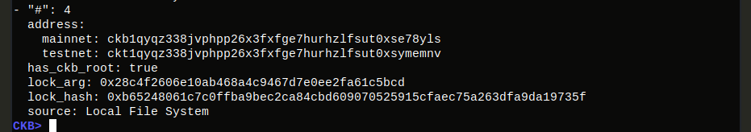
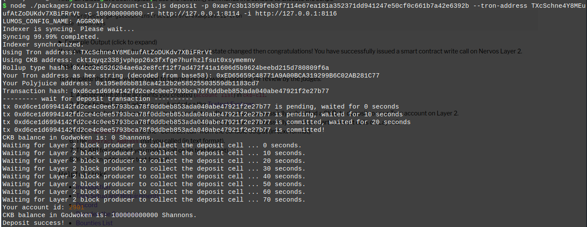
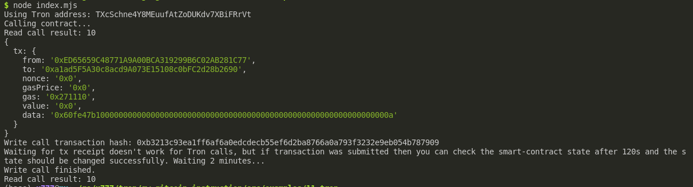

* ### Gitcoin: 11) Use A Tron Wallet To Execute A Smart Contract Call

* A screenshot of the accounts you created (account list) in ckb-cli:



* A link to the Layer 1 address you funded on the Testnet Explorer:

https://explorer.nervos.org/aggron/address/ckt1qyqz338jvphpp26x3fxfge7hurhzlfsut0xsymemnv

* A screenshot of the console output immediately after you have successfully submitted a CKByte deposit to your Tron account on Layer 2:



* A screenshot of the console output immediately after you have successfully issued a smart contract calls on Layer 2:



* The transaction hash of the "Contract call" from the console output:
`0xb3213c93ea1ff6af6a0edcdecb55ef6d2ba8766a0a793f3232e9eb054b787909`

* The contract address that you called:
`0xa1ad5F5A30c8acd9A073E15108c0bFC2d28b2690`

* The ABI for contract you made a call on:
```[
  {
    "inputs": [],
    "stateMutability": "payable",
    "type": "constructor"
  },
  {
    "inputs": [
      {
        "internalType": "uint256",
        "name": "x",
        "type": "uint256"
      }
    ],
    "name": "set",
    "outputs": [],
    "stateMutability": "payable",
    "type": "function"
  },
  {
    "inputs": [],
    "name": "get",
    "outputs": [
      {
        "internalType": "uint256",
        "name": "",
        "type": "uint256"
      }
    ],
    "stateMutability": "view",
    "type": "function"
  }
]```

* Your Tron address:
`TXcSchne4Y8MEuufAtZoDUKdv7XBiFRrVt`